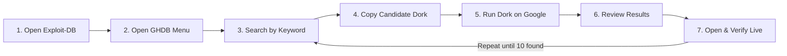

<div align="center">

# 🔍 Footprinting & Reconnaissance Attacks with GHDB

### Passive OSINT Recon Using the Google Hacking Database


*Week 2 · Project Module 2 — Networkwalks Cybersecurity & Ethical Hacking Track*

**📄 [View Full Evidence & Findings →](EVIDENCE.md)**

</div>

---

## 📑 Table of ContentS

- [Background](#-background)
- [Objective](#-objective)
- [Methodology at a Glance](#️-methodology-at-a-glance)
- [Results Summary](#-results-summary)
- [Why GHDB Matters](#-why-ghdb-matters-in-footprinting)
- [Repository Structure](#-repository-structure)
- [Liability Disclaimer](#️-liability-disclaimer)

---

## ⚠️ Liability Disclaimer

> These materials are for **education and research purposes only**. This repository documents a **passive** OSINT/footprinting exercise performed entirely through publicly indexed Google search results. No target was scanned, brute-forced, or logged into beyond opening a public search result in a browser.
>
> **Hacking is only legal when:**
> - You test a device or network **you own**, or that is in **your lab environment**
> - You have **written, documented permission** from the owner
> - You are working as a security professional under a **signed agreement with an agreed scope**
>
> Everything outside these cases is illegal. Unauthorized access is a crime in most countries even when nothing is damaged — **you are solely responsible for how you use this information.**

---

## 📖 Background

**GHDB (Google Hacking Database)** is a large, community-maintained collection of ready-made Google search queries — known as **"Google dorks"** — hosted on [exploit-db.com](https://www.exploit-db.com/google-hacking-database).

Dorks combine ordinary Google search operators (`intitle:`, `inurl:`, `intext:`, `index.of`, etc.) in clever ways to surface information that a website has *accidentally* left publicly indexed — exposed camera feeds, open directories, login portals, configuration files, and leaked documents.

GHDB was built for **pentesters and security researchers** so they can find and fix these leaks before someone else finds them maliciously.

Because GHDB relies entirely on Google's own index, this is one of the **quietest forms of footprinting**: the target is never directly contacted or scanned, and has no way of knowing it was found this way.

| Used by | For |
|---|---|
| 🔴 Attackers | Building a picture of a target's exposed surface before ever touching it |
| 🛡️ Defenders & researchers | Discovering what their own organization leaks — and fixing it first |

> 💡 **Key takeaway:** the less an organization exposes to Google's crawlers, the smaller its attack surface becomes.

---

## 🎯 Objective

In this module, GHDB dorks were used to footprint real targets through Google alone — **without ever touching the target directly**. Each result was manually opened and verified, and every finding was logged with the exact dork used.

| Task | Goal | Status |
|---|---|---|
| **Task 1** | Find **10 live**, publicly exposed security camera links | ✅ 15 found |
| **Task 2** | Find **10 publicly indexed** directory listings with downloadable mathematics PDFs | ✅ 10 found |

➡️ Full findings tables with links, dorks, and credentials → **[EVIDENCE.md](EVIDENCE.md)**

---

## 🛠️ Methodology at a Glance

Both tasks follow the same 7-step passive recon loop — only the keyword and dork differ.



| Step | Action |
|:---:|---|
| 1 | Open [exploit-db.com](https://www.exploit-db.com) |
| 2 | Navigate to the **GHDB** section from the left-hand menu |
| 3 | Search GHDB for a relevant keyword (`cam`, `index of`) |
| 4 | Copy a candidate dork from the results list |
| 5 | Paste the dork into **google.com** and run the search |
| 6 | Open each result and manually verify it is live and matches the criteria |
| 7 | Repeat until 10+ verified results are collected, logging link + dork |

🖼️ **Full step-by-step screenshots for every step (both tasks) → [EVIDENCE.md](EVIDENCE.md#-task-1-walkthrough--exposed-security-cameras)**

---

## 📊 Results Summary

<table>
<tr>
<td align="center" width="50%">

### 📸 Task 1 — Cameras
**15 live feeds found**
Dork: `intitle:"webcamXP" inurl:8080`

[→ See full table + screenshots](EVIDENCE.md#-task-1-findings-table)

</td>
<td align="center" width="50%">

### 📚 Task 2 — Math PDFs
**10 open directories found**
Dork: `intitle:index.of "parent directory" mathematics pdf`

[→ See full table + screenshots](EVIDENCE.md#-task-2-findings-table)

</td>
</tr>
</table>

---

## 🧠 Why GHDB Matters in Footprinting

Reconnaissance is the first stage of every real attack. Before touching a target, an attacker quietly builds a full picture of it using only public information — and Google is one of the richest sources of that information. Google constantly crawls and indexes almost everything a website exposes, so an attacker often doesn't need any special tool, just the right search.

This is where GHDB becomes powerful. Its dorks turn ordinary Google into a precise recon tool that surfaces exposed cameras, open folders, backup files, login portals, and leaked documents that owners never meant to publish. Because all of this comes straight from Google, the target is never contacted and never knows it is being studied — making GHDB one of the quietest and hardest-to-detect forms of footprinting.

The same dorks that an attacker uses to find weaknesses are also used by **defenders** to search their own domains, discover what they're leaking, and lock it down before someone else finds it.

> 💡 The lesson is simple: **the less an organization exposes to Google, the smaller its attack surface becomes.**

---

## 📎 Bonus: Additional Dorks to Practice

<details>
<summary>📷 More camera-related dorks</summary>

```text
allintitle: "Network Camera NetworkCamera"
intitle:"EvoCam" inurl:"webcam.html"
intitle:"Live View / - AXIS"
intitle:"LiveView / - AXIS" | inurl:view/view.shtml
inurl:indexFrame.shtml "Axis Video Server"
inurl:axis-cgi/jpg
inurl:"MultiCameraFrame?Mode=Motion"
inurl:/view.shtml
inurl:/view/index.shtml
"my webcamXP server!"
```

</details>

<details>
<summary>🗃️ Exploit-DB also hosts a full exploit archive</summary>

Beyond GHDB, [exploit-db.com](https://www.exploit-db.com/) lists thousands of current, real-world exploits (WebApps, Remote, Local, Hardware, etc.) that can be studied to build deeper offensive-security knowledge.

</details>

---

## 📂 Repository Structure

```
ghdb-footprinting-lab/
├── README.md                            # 👈 You are here — overview & summary
├── EVIDENCE.md                           # Full findings tables + all screenshots
└── assets/
    └── screenshots/
        ├── task1-camera/                 # Task 1 walkthrough (7 steps)
        │   ├── 01-exploitdb-home.png
        │   ├── 02-ghdb-menu.png
        │   ├── 03-ghdb-search-cam.png
        │   ├── 04-copy-dork.png
        │   ├── 05-google-search-dork.png
        │   ├── 06-google-results.png
        │   └── 07-live-camera-verified.png
        └── task2-pdf/                    # Task 2 walkthrough (4 steps)
            └── README.md                  # Naming guide — screenshots pending
```

---

## 🔗 References

- [Exploit-DB — Google Hacking Database](https://www.exploit-db.com/google-hacking-database)
- [Networkwalks Academy](https://www.networkwalks.com)

## 📬 Contact

Questions, comments, and suggestions are welcome.

**Networkwalks Academy** — Cisco CCNA · Cybersecurity · Ethical Hacking · Python · Linux · AI
📧 info@networkwalks.com

---

<div align="center">

*This repository is a training artifact from a structured cybersecurity course, shared strictly for educational demonstration of OSINT/footprinting methodology.*

**📄 Continue to → [EVIDENCE.md](EVIDENCE.md) for the complete findings tables and screenshot walkthrough**

</div>
